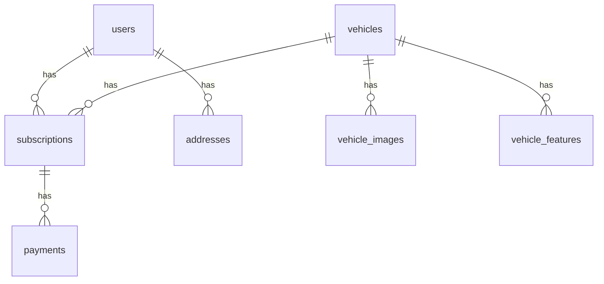

# Faith Auto Database Schema

## Overview

The Faith Auto database uses PostgreSQL and follows a normalized structure to ensure data integrity and efficient querying.

## Schema Diagram



## Tables

### users

```sql
CREATE TABLE users (
    id SERIAL PRIMARY KEY,
    email VARCHAR(255) UNIQUE NOT NULL,
    password_hash VARCHAR(255) NOT NULL,
    first_name VARCHAR(100) NOT NULL,
    last_name VARCHAR(100) NOT NULL,
    phone VARCHAR(20),
    created_at TIMESTAMP WITH TIME ZONE DEFAULT CURRENT_TIMESTAMP,
    updated_at TIMESTAMP WITH TIME ZONE DEFAULT CURRENT_TIMESTAMP,
    last_login TIMESTAMP WITH TIME ZONE,
    is_active BOOLEAN DEFAULT true,
    is_verified BOOLEAN DEFAULT false
);
```

### addresses

```sql
CREATE TABLE addresses (
    id SERIAL PRIMARY KEY,
    user_id INTEGER REFERENCES users(id),
    street VARCHAR(255) NOT NULL,
    city VARCHAR(100) NOT NULL,
    state VARCHAR(100) NOT NULL,
    postcode VARCHAR(20) NOT NULL,
    country VARCHAR(100) DEFAULT 'Australia',
    is_default BOOLEAN DEFAULT false,
    created_at TIMESTAMP WITH TIME ZONE DEFAULT CURRENT_TIMESTAMP,
    updated_at TIMESTAMP WITH TIME ZONE DEFAULT CURRENT_TIMESTAMP
);
```

### vehicles

```sql
CREATE TABLE vehicles (
    id SERIAL PRIMARY KEY,
    make VARCHAR(100) NOT NULL,
    model VARCHAR(100) NOT NULL,
    year INTEGER NOT NULL,
    body_type VARCHAR(50) NOT NULL,
    fuel_type VARCHAR(50) NOT NULL,
    seats INTEGER NOT NULL,
    price_per_month DECIMAL(10,2) NOT NULL,
    status VARCHAR(20) DEFAULT 'available',
    vin VARCHAR(17) UNIQUE,
    registration_number VARCHAR(20) UNIQUE,
    created_at TIMESTAMP WITH TIME ZONE DEFAULT CURRENT_TIMESTAMP,
    updated_at TIMESTAMP WITH TIME ZONE DEFAULT CURRENT_TIMESTAMP
);
```

### vehicle_images

```sql
CREATE TABLE vehicle_images (
    id SERIAL PRIMARY KEY,
    vehicle_id INTEGER REFERENCES vehicles(id),
    image_url VARCHAR(255) NOT NULL,
    is_primary BOOLEAN DEFAULT false,
    created_at TIMESTAMP WITH TIME ZONE DEFAULT CURRENT_TIMESTAMP
);
```

### vehicle_features

```sql
CREATE TABLE vehicle_features (
    id SERIAL PRIMARY KEY,
    vehicle_id INTEGER REFERENCES vehicles(id),
    feature_name VARCHAR(100) NOT NULL,
    feature_value TEXT,
    created_at TIMESTAMP WITH TIME ZONE DEFAULT CURRENT_TIMESTAMP
);
```

### subscriptions

```sql
CREATE TABLE subscriptions (
    id SERIAL PRIMARY KEY,
    user_id INTEGER REFERENCES users(id),
    vehicle_id INTEGER REFERENCES vehicles(id),
    start_date DATE NOT NULL,
    end_date DATE NOT NULL,
    status VARCHAR(20) DEFAULT 'active',
    monthly_payment DECIMAL(10,2) NOT NULL,
    delivery_address_id INTEGER REFERENCES addresses(id),
    created_at TIMESTAMP WITH TIME ZONE DEFAULT CURRENT_TIMESTAMP,
    updated_at TIMESTAMP WITH TIME ZONE DEFAULT CURRENT_TIMESTAMP
);
```

### payments

```sql
CREATE TABLE payments (
    id SERIAL PRIMARY KEY,
    subscription_id INTEGER REFERENCES subscriptions(id),
    amount DECIMAL(10,2) NOT NULL,
    payment_method VARCHAR(50) NOT NULL,
    transaction_id VARCHAR(255) UNIQUE,
    status VARCHAR(20) DEFAULT 'pending',
    payment_date TIMESTAMP WITH TIME ZONE DEFAULT CURRENT_TIMESTAMP,
    created_at TIMESTAMP WITH TIME ZONE DEFAULT CURRENT_TIMESTAMP,
    updated_at TIMESTAMP WITH TIME ZONE DEFAULT CURRENT_TIMESTAMP
);
```

## Indexes

```sql
-- Users
CREATE INDEX idx_users_email ON users(email);
CREATE INDEX idx_users_phone ON users(phone);

-- Vehicles
CREATE INDEX idx_vehicles_status ON vehicles(status);
CREATE INDEX idx_vehicles_make_model ON vehicles(make, model);
CREATE INDEX idx_vehicles_price ON vehicles(price_per_month);

-- Subscriptions
CREATE INDEX idx_subscriptions_user ON subscriptions(user_id);
CREATE INDEX idx_subscriptions_vehicle ON subscriptions(vehicle_id);
CREATE INDEX idx_subscriptions_status ON subscriptions(status);
CREATE INDEX idx_subscriptions_dates ON subscriptions(start_date, end_date);

-- Payments
CREATE INDEX idx_payments_subscription ON payments(subscription_id);
CREATE INDEX idx_payments_status ON payments(status);
CREATE INDEX idx_payments_date ON payments(payment_date);
```

## Constraints

```sql
-- Vehicle Status Check
ALTER TABLE vehicles
ADD CONSTRAINT check_vehicle_status
CHECK (status IN ('available', 'reserved', 'in_use', 'maintenance'));

-- Subscription Status Check
ALTER TABLE subscriptions
ADD CONSTRAINT check_subscription_status
CHECK (status IN ('active', 'pending', 'completed', 'cancelled'));

-- Payment Status Check
ALTER TABLE payments
ADD CONSTRAINT check_payment_status
CHECK (status IN ('pending', 'completed', 'failed', 'refunded'));

-- Date Validation
ALTER TABLE subscriptions
ADD CONSTRAINT check_subscription_dates
CHECK (end_date > start_date);
```

## Views

### active_subscriptions

```sql
CREATE VIEW active_subscriptions AS
SELECT 
    s.id,
    u.email,
    v.make,
    v.model,
    s.start_date,
    s.end_date,
    s.monthly_payment,
    a.city as delivery_city
FROM subscriptions s
JOIN users u ON s.user_id = u.id
JOIN vehicles v ON s.vehicle_id = v.id
JOIN addresses a ON s.delivery_address_id = a.id
WHERE s.status = 'active'
AND s.end_date >= CURRENT_DATE;
```

### vehicle_availability

```sql
CREATE VIEW vehicle_availability AS
SELECT 
    v.id,
    v.make,
    v.model,
    v.body_type,
    v.fuel_type,
    v.seats,
    v.price_per_month,
    v.status,
    COUNT(s.id) as active_subscriptions
FROM vehicles v
LEFT JOIN subscriptions s ON v.id = s.vehicle_id 
    AND s.status = 'active'
GROUP BY v.id;
```

## Functions

### calculate_subscription_price

```sql
CREATE OR REPLACE FUNCTION calculate_subscription_price(
    vehicle_id INTEGER,
    duration_months INTEGER
) RETURNS DECIMAL AS $$
DECLARE
    base_price DECIMAL;
BEGIN
    SELECT price_per_month INTO base_price
    FROM vehicles
    WHERE id = vehicle_id;
    
    RETURN base_price * duration_months;
END;
$$ LANGUAGE plpgsql;
```

### check_vehicle_availability

```sql
CREATE OR REPLACE FUNCTION check_vehicle_availability(
    vehicle_id INTEGER,
    start_date DATE,
    end_date DATE
) RETURNS BOOLEAN AS $$
DECLARE
    overlapping_subscriptions INTEGER;
BEGIN
    SELECT COUNT(*)
    INTO overlapping_subscriptions
    FROM subscriptions
    WHERE vehicle_id = $1
    AND status = 'active'
    AND (
        (start_date, end_date) OVERLAPS ($2, $3)
    );
    
    RETURN overlapping_subscriptions = 0;
END;
$$ LANGUAGE plpgsql;
```

## Triggers

### update_vehicle_status

```sql
CREATE OR REPLACE FUNCTION update_vehicle_status()
RETURNS TRIGGER AS $$
BEGIN
    IF NEW.status = 'in_use' THEN
        UPDATE vehicles
        SET status = 'in_use'
        WHERE id = NEW.vehicle_id;
    ELSIF OLD.status = 'in_use' AND NEW.status = 'completed' THEN
        UPDATE vehicles
        SET status = 'available'
        WHERE id = OLD.vehicle_id;
    END IF;
    RETURN NEW;
END;
$$ LANGUAGE plpgsql;

CREATE TRIGGER subscription_status_change
AFTER UPDATE OF status ON subscriptions
FOR EACH ROW
EXECUTE FUNCTION update_vehicle_status();
```

### update_timestamps

```sql
CREATE OR REPLACE FUNCTION update_timestamps()
RETURNS TRIGGER AS $$
BEGIN
    NEW.updated_at = CURRENT_TIMESTAMP;
    RETURN NEW;
END;
$$ LANGUAGE plpgsql;

CREATE TRIGGER update_users_timestamp
BEFORE UPDATE ON users
FOR EACH ROW
EXECUTE FUNCTION update_timestamps();
``` 